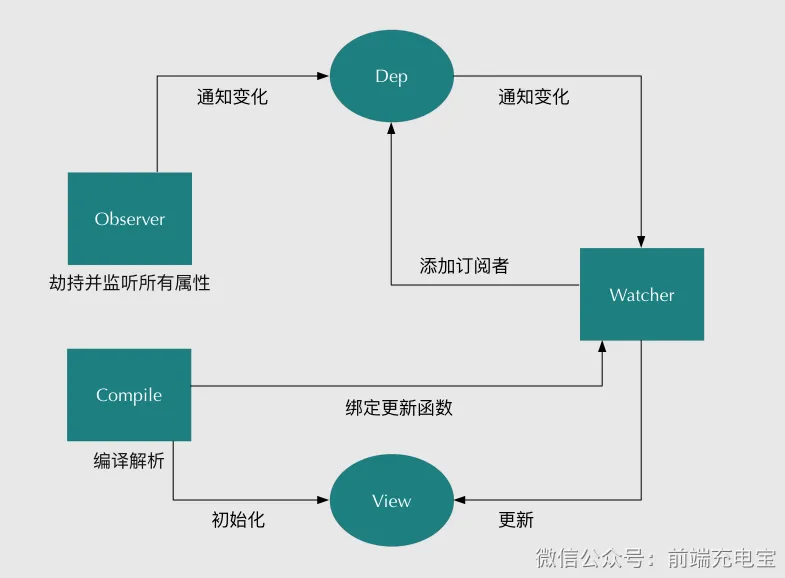

# Vue
- 数据双向绑定
    -  Vue.js 是采用数据劫持结合发布者-订阅者模式的方式，通过Object.defineProperty()来劫持各个属性的setter，getter，在数据变动时发布消息给订阅者，触发相应的监听回调
    - Vue2在组件初始化的时候会对响应式数据进行Observe，通过Object.defineProperty进行数据劫持和收集依赖，在getter函数里创建属性对应的Dep依赖实例，也就是订阅器，
    - compile解析模板指令，将模板中的变量替换成数据，然后初始化渲染页面视图，创建Watcher订阅者实例，并将每个指令对应的节点绑定更新函数，添加监听数据的订阅者
    - Watcher订阅者是Observer和Compile之间通信的桥梁，
  1️⃣在自身实例化时往属性订阅器(dep)里面添加自己 ，怎么添加？（将Dep.target赋值为自身，去访问原属性，由于数据劫持，会调用原属性的Get()方法，添加订阅者到dep.sub中，绑定更新回调函数）
  2️⃣自身必须有一个update()方法 
  3️⃣待属性变动dep.notice()通知时，能调用自身的update()方法，并触发Compile中绑定的回调
    
- Keep-alive原理
1. 获取 keep-alive 包裹着的第一个子组件对象及其组件名； 如果 keep-alive 存在多个子元素，keep-alive 要求同时只有一个子元素被渲染。所以在开头会获取插槽内的子元素，调用 getFirstComponentChild 获取到第一个子元素的 VNode。
根据设定的黑白名单（如果有）进行条件匹配，决定是否缓存。不匹配，直接返回组件实例（VNode），否则开启缓存策略。
2. 根据组件ID和tag生成缓存Key，并在缓存对象中查找是否已缓存过该组件实例。如果存在，直接取出缓存值并更新该key在this.keys中的位置（更新key的位置是实现LRU置换策略的关键）。
3. 如果不存在，则在this.cache对象中存储该组件实例并保存key值，之后检查缓存的实例数量是否超过max设置值，超过则根据LRU置换策略删除最近最久未使用的实例（即是下标为0的那个key）。最后将该组件实例的keepAlive属性值设置为true。
