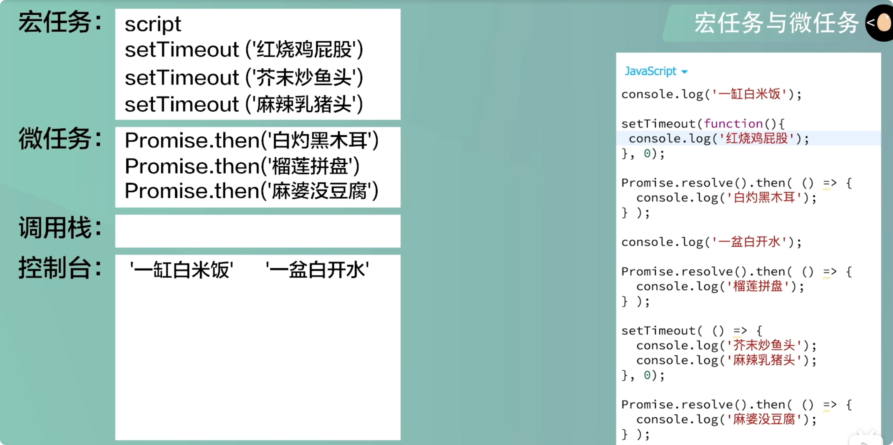
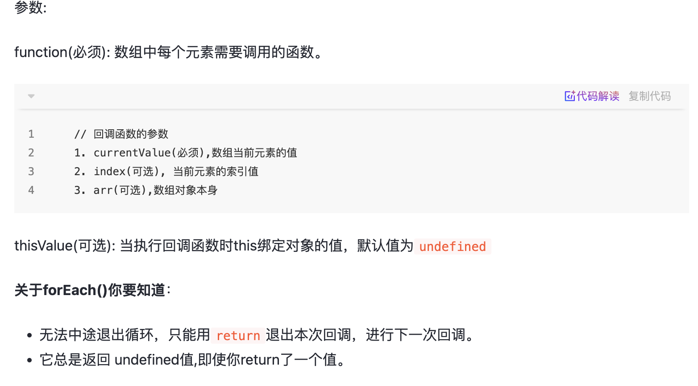
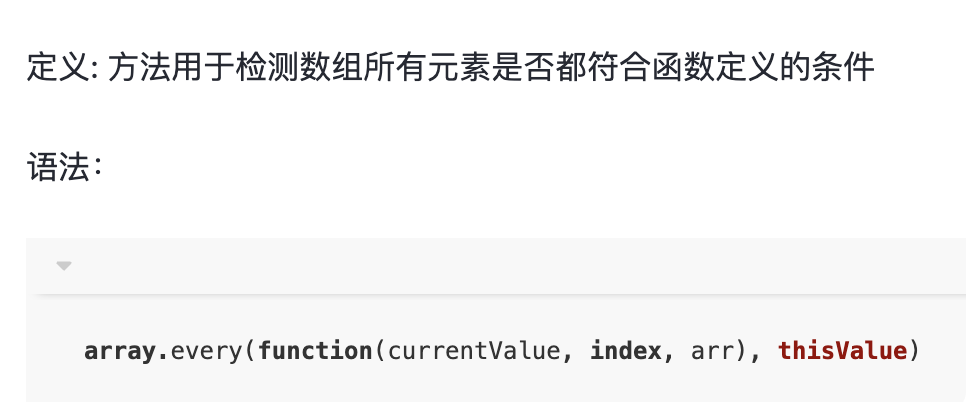

# 面试题

- 事件循环
  

js 是单线程语言，程序调用执行时，比如说一个 Script 标签执行时会创建宏任务队列，微任务队列，和执行栈，会优先执行同步任务，遇到特定函数会创建宏任务与微任务，调用栈里的任务执行完后，会扫描微任务队列，然后执行

- == 和 ===
  基本数据类型的比较和引用类型的比较不一样，引用类型的数据比较的是地址
  `== `如果两边的类型不一致，则会进行强制类型转化后再进行比较
  `===` 如果两边的类型不一致时，不会做强制类型准换，直接返回 false
  NaN 是 Number 类型，但是没有自反性,不与自身相等
  `undefined == null // true `

---

- 数组方法集合
  `Arrary.from()`
  定义：用于将两类对象转为真正的数组（不改变原对象，返回新的数组）。
  参数：
  第一个参数(必需):要转化为真正数组的对象。
  第二个参数(可选): 类似数组的 map 方法，对每个元素进行处理，将处理后的值放入返回的数组。
  第三个参数(可选): 用来绑定 this。

---

### 改变数组的方法

- **splice()** 添加/删除数组元素
  **定义：** splice() 方法向/从数组中添加/删除项目，然后返回被删除的项目
  **语法**： `array.splice(index,howmany,item1,.....,itemX)`
  **参数:**
  index：必需。整数，规定添加/删除项目的位置，使用负数可从数组结尾处规定位置。
  howmany：可选。要删除的项目数量。如果设置为 0，则不会删除项目。
  item1, ..., itemX： 可选。向数组添加的新项目
  **返回值:** 如果有元素被删除,返回包含被删除项目的新数组
- **sort()**
  sort()方法对数组元素进行排序，并返回这个数组  
   默认情况下 sort()方法没有传比较函数的话，默认按字母升序，如果不是元素不是字符串的话，会调用 toString()方法将元素转化为字符串的 Unicode(万国码)位点，然后再比较字符
  比较函数的两个参数：
  sort 的比较函数有两个默认参数，要在函数中接收这两个参数，这两个参数是数组中两个要比较的元素，通常我们用 a 和 b 接收两个将要比较的元素：
  若比较函数返回值<0，那么 a 将排到 b 的前面;
  若比较函数返回值=0，那么 a 和 b 相对位置不变；
  若比较函数返回值>0，那么 b 排在 a 将的前面
- **pop()** 方法删除一个数组中的最后的一个元素，并且返回这个元素
- **shift()**删除数组的第一个元素
- **push()** 向数组的末尾添加元素
- **unshift()**方法可向数组的开头添加一个或更多元素，并返回新的长度
- **reverse()** 颠倒数组中元素的顺序

### 不改变原数组的方法

- **slice()** 浅拷贝数组的元素
  方法返回一个从开始到结束（不包括结束）选择的数组的一部分浅拷贝到一个新数组对象，且原数组不会被修改
  `    array.slice(begin, end);`
  新数组是**浅拷贝**的，元素是简单数据类型，改变之后不会互相干扰。
  如果是复杂数据类型(对象,数组)的话，改变其中一个，另外一个也会改变
- **join()** 数组转字符串 join() 方法用于把数组中的所有元素通过指定的分隔符进行分隔放入一个字符串，返回生成的字符串
  `join()/toString()` 方法在数组元素是数组的时候，会将里面的数组也调用 join()/toString(),如果是对象的话，对象会被转为[object Object]字符串
- **concat()** 方法用于合并两个或多个数组，返回一个新数组。
- **indexOf()** 查找数组是否存在某个元素，返回下标
  返回在数组中可以找到一个给定元素的第一个索引，如果不存在，则返回-1
  array.indexOf(searchElement,fromIndex)
- **lastIndexOf()** 查找指定元素在数组中的最后一个位置
- **includes()** 查找数组是否包含某个元素 返回布尔

### 数组遍历方法

- **forEach**
  定义: 按升序为数组中含有效值的每一项执行一次回调函数。
  
- **every()** 检测数组所有元素是否都符合判断条件
    
  方法返回值规则:

1. 如果数组中检测到有一个元素不满足，则整个表达式返回 false，且剩余的元素不会再进行检测。
2. 如果所有元素都满足条件，则返回 true。

- **some()** 数组中的是否有满足判断条件的元素
  方法返回值规则：

1. 如果有一个元素满足条件，则表达式返回 true, 剩余的元素不会再执行检测。

2. 如果没有满足条件的元素，则返回 false

- **filter()** 过滤原始数组，返回新数组
  定义: 返回一个新数组, 其包含通过所提供函数实现的测试的所有元素
- **map()** 对数组中的每个元素进行处理，返回新的数组
  定义：创建一个新数组，其结果是该数组中的每个元素都调用一个提供的函数后返回的结果

- **reduce()** 为数组提供累加器，合并为一个值reduce() 
  方法对累加器和数组中的每个元素（从左到右）应用一个函数，最终合并为一个值。

- **keys()&values()&entries()** 遍历键名、遍历键值、遍历键名+键值
三个方法都返回一个新的 Array Iterator 对象，对象根据方法不同包含不同的值

