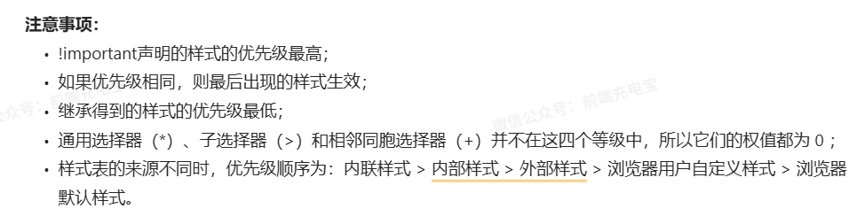
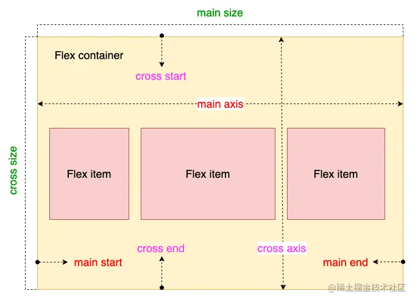

# css

## **css 选择器**

!important > id > 类选择器/伪类选择器/属性选择器 > 标签选择器/伪元素选择器 > 兄弟、子、后代、通配符选择器


## **flex 布局**

flex 布局是 CSS3 新增的一种布局方式，可以通过将一个元素的 display 属性值设置为 flex 从而使它成为一个 flex 容器，它的所有子元素都会成为它的项目。一个容器默认有两条轴：一个是水平的主轴，一个是与主轴垂直的交叉轴。可以使用 flex-direction 来指定主轴的方向。可以使用 justify-content 来指定元素在主轴上的排列方式，使用 align-items 来指定元素在交叉轴上的排列方式。还可以使用 flex-wrap 来规定当一行排列不下时的换行方式。对于容器中的项目，可以使用 order 属性来指定项目的排列顺序，还可以使用 flex-grow 来指定当排列空间有剩余的时候，项目的放大比例，还可以使用 flex-shrink 来指定当排列空间不足时，项目的缩小比例
Flexbox 布局也叫 Flex 布局，弹性盒子布局
容器默认存在两根轴: 水平的主轴（main axis）和垂直的交叉轴（cross axis）
  
 以下 6 个属性设置在**容器**上。

```css
/* 容器属性 */
- flex-direction // flex布局的主轴方向
- flex-wrap  // 是否换行
- flex-flow // flex-direction 和 flex-wrap 的简写形式
- justify-content // 属性定义了项目在主轴上的对齐方式
- align-items // 属性定义项目在交叉轴上如何对齐
- align-content // 属性定义了多根轴线的对齐方式。如果项目只有一根轴线，该属性不起作用
```

以下 6 个属性设置在**项目**上

```css
/* 项目属性 */
.item{
order // 属性用来定义项目的排列顺序。数值越小，排列越靠前，默认为 0
flex-grow // 属性定义项目的放大比例，默认为 0 ，即如果存在剩余空间，也不放大
flex-shrink // 属性定义了项目的缩小比例，默认为 1 ，即如果空间不足，该项目将缩小
flex-basis // 属性定义了在分配多余空间之前，项目占据的主轴空间（main size）。浏览器根据这个属性，计算主轴是否有多余空间。它的默认值为auto，即项目的本来大小
flex // flex属性是flex-grow, flex-shrink 和 flex-basis的简写，默认值为0 1 auto
align-self //属性允许单个项目有与其他项目不一样的对齐方式，可覆盖align-items属性。默认值为auto，表示继承父元素的align-items属性，如果没有父元素，则等同于stretch
}

```

flex 属性
该属性有两个快捷值 `auto (1 1 auto) ` 即在有剩余空间时，只缩小不放大和 `none (0 0 auto)` 即有剩余空间时，不放大也不缩小，最终尺寸通常表现为最大内容宽度

---

**flex: 0**
即当有剩余空间时，项目宽度为其内容的宽度，最终尺寸表现为最小内容宽度。

```css
.item {
  flex: 0 1 0%;
}
.item {
  flex-grow: 0;
  flex-shrink: 1;
  flex-basis: 0%;
}
```

---

**flex: auto**
即元素尺寸可以弹性增大，也可以弹性变小，具有十足的弹性，但在尺寸不足时会优先最大化内容尺寸

```css
.item {
  flex: 1 1 auto;
}
.item {
  flex-grow: 1;
  flex-shrink: 1;
  flex-basis: auto;
}
```

---

**flex: 1**
即元素尺寸可以弹性增大，也可以弹性变小，具有十足的弹性，但是在尺寸不足时会优先最小化内容尺寸

```css
.item {
  flex: 1 1 0%;
}
.item {
  flex-grow: 1;
  flex-shrink: 1;
  flex-basis: 0%;
}
```

## **BFC**

● Box: Box 是 CSS 布局的对象和基本单位，⼀个⻚⾯是由很多个 Box 组成的，这个 Box 就是我们所说的盒模型。
● Formatting context：块级上下⽂格式化，它是⻚⾯中的⼀块渲染区域，并且有⼀套渲染规则，它决定了其⼦元素将如何定位，以及和其他元素的关系和相互作⽤
**块格式化上下文（Block Formatting Context，BFC**是 Web 页面的可视化 CSS 渲染的一部分，是布局过程中生成块级盒子的区域，也是浮动元素与其他元素的交互限定区域
通俗来讲：BFC 是一个独立的布局环境，可以理解为一个容器，在这个容器中按照一定规则进行物品摆放，并且不会影响其它环境中的物品。如果一个元素符合触发 BFC 的条件，则 BFC 中的元素布局不受外部影响

- **创建 BFC 的条件**：
  ● 根元素：body；
  ● 元素设置浮动：float 除 none 以外的值；
  ● 元素设置绝对定位：position (absolute、fixed)；
  ● display 值为：inline-block、table-cell、table-caption、flex 等；
  ● overflow 值为：hidden、auto、scroll
- **BFC 的特点**：
  ● 垂直方向上，自上而下排列，和文档流的排列方式一致。
  ● 在 BFC 中上下相邻的两个容器的 margin 会重叠
  ● 计算 BFC 的高度时，需要计算浮动元素的高度
  ● BFC 区域不会与浮动的容器发生重叠
  ● BFC 是独立的容器，容器内部元素不会影响外部元素
  ● 每个元素的左 margin 值和容器的左 border
- **BFC 的作用：**
  ● 解决 margin 的重叠问题：由于 BFC 是一个独立的区域，内部的元素和外部的元素互不影响，将两个元素变为两个 BFC，就解决了 margin 重叠的问题。
  ● 解决高度塌陷的问题：在对子元素设置浮动后，父元素会发生高度塌陷，也就是父元素的高度变为 0。解决这个问题，只需要把父元素变成一个 BFC。常用的办法是给父元素设置 overflow:hidden

## **外边距重叠**

两个块级元素的上外边距和下外边距可能会合并（折叠）为一个外边距，其大小会取其中外边距值大的那个，这种行为就是外边距折叠。需要注意的是，**浮动的元素和绝对定位这种脱离文档流的元素的外边距不会折叠**。重叠只会出现在**垂直方向**
**计算原则：**
折叠合并后外边距的计算原则如下：
● 如果两者都是正数，那么就去最大者
● 如果是一正一负，就会正值减去负值的绝对值
● 两个都是负值时，用 0 减去两个中绝对值大的那个

**解决办法：**
对于折叠的情况，主要有两种：兄弟之间重叠和父子之间重叠
**（1）兄弟之间重叠**
● 底部元素变为行内盒子：display: inline-block
● 底部元素设置浮动：float
**● 底部元素的 position 的值为 absolute/fixed** **√**
**（2）父子之间重叠**
**● 父元素加入：overflow: hidden**
● 父元素添加透明边框：border:1px solid transparent
● 子元素变为行内盒子：display: inline-block
● 子元素加入浮动属性或定位

# JS

## let、const、var 的区别

1. 块级作用域：块作用域由 { }包括，let 和 const 具有块级作用域，var 不存在块级作用域。块级作用域解决了 ES5 中的两个问题：
  ● 内层变量可能覆盖外层变量
  ● 用来计数的循环变量泄露为全局变量
2. 变量提升：var 存在变量提升，let 和 const 不存在变量提升，即在变量只能在声明之后使用，否在会报错。
3. 给全局添加属性：浏览器的全局对象是 window，Node 的全局对象是 global。var 声明的变量为全局变量，并且会将该变量添加为全局对象的属性，但是 let 和 const 不会。
4. 重复声明：var 声明变量时，可以重复声明变量，后声明的同名变量会覆盖之前声明的遍历。const 和 let 不允许重复声明变量。
5. 暂时性死区：在使用 let、const 命令声明变量之前，该变量都是不可用的。这在语法上，称为暂时性死区。使用 var 声明的变量不存在暂时性死区。
6. 初始值设置：在变量声明时，var 和 let 可以不用设置初始值。而 const 声明变量必须设置初始值。
7. 指针指向：let 和 const 都是 ES6 新增的用于创建变量的语法。 let 创建的变量是可以更改指针指向（可以重新赋值）。但 const 声明的变量是不允许改变指针的指向

## 类型比较

