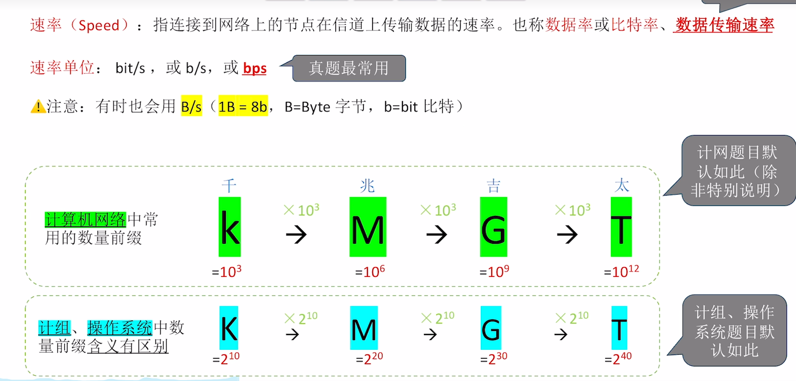

## 计算机网络

## 第一章

### 1. 电路交换，报文交换，分组交换

### 2. 网络性能指标

  
**bps** （bit per second）

## 时延

## 时延带宽积

## 往返时延

## 总结

### 3. 网络结构

### 总结

### OSI 模型

### 2 层数据链路层

### 3 层网络层

### 4 层传输层

### 功能总结

### TCP/IP 协议

### 对比网络层

### 信道信号

#### 带宽

#### 俩信道相关定理

  
  

### 编译与解码

#### 总结

  
  

### 冲突域

### 5-4-3 原则

### 第三章

### 3.1 链路层

### 捡错编码 CRC 循环冗余码

### 流量控制

### 信道利用率

### GBN 协议(后退 N 帧协议)

## 例题

### 选择重传协议

### 信道介质访问控制

#### 频分多路复用

#### 时分复用 TDM

#### 统计时分复用

#### 波分多路复用

#### 码分多路复用

### 动态介质访问

### 时隙 ALOHA 协议

### csma 协议

  
  
  
  

### CSMA/CD collision detection(碰撞检测)

### CSMA/CA collision avoidance(碰撞避免)

### 轮询

### 局域网

### 以太网

  
  

  
  
  
  
### 无线局域网
  

  
  
### VLAN
  
  
  
### 广域网
  
### ppp协议
  
  
  
  
  
  
  
