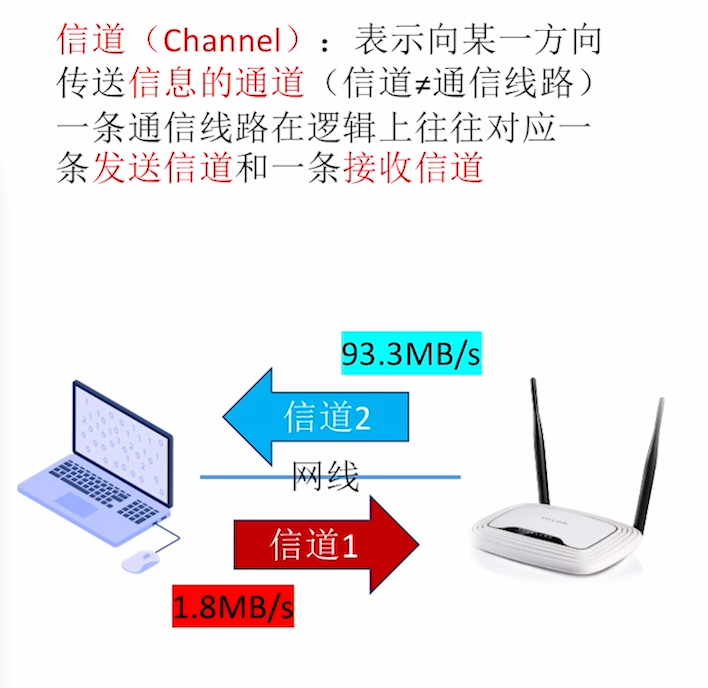
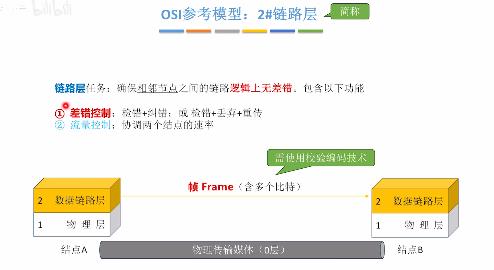

## 计算机网络

## 第一章

### 1. 电路交换，报文交换，分组交换

### 2. 网络性能指标

  
**bps** （bit per second）

## 时延

## 时延带宽积

## 往返时延

## 总结

### 3. 网络结构

### 总结

### OSI 模型

### 2 层数据链路层

### 3 层网络层

### 4 层传输层

### 功能总结

### TCP/IP 协议

### 对比网络层

### 信道信号

#### 带宽

#### 俩信道相关定理

  
  

### 编译与解码

#### 总结

  
  

### 冲突域

### 5-4-3 原则

### 第三章

### 3.1 链路层

### 捡错编码 CRC 循环冗余码

### 流量控制

