# 软件工程

## 软件工程概述

- 生命周期
  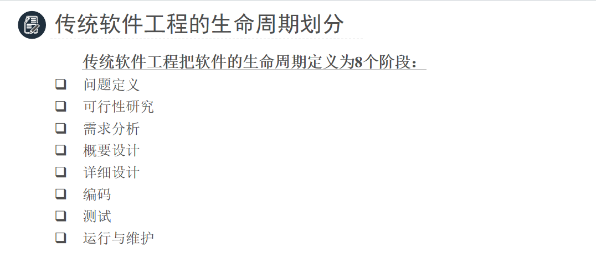
- 瀑布模型
  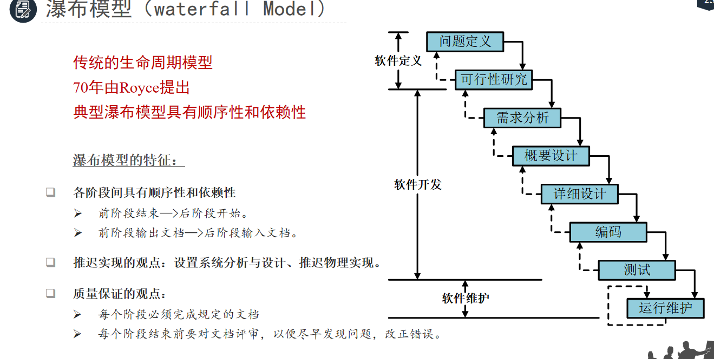
- 原型模型
  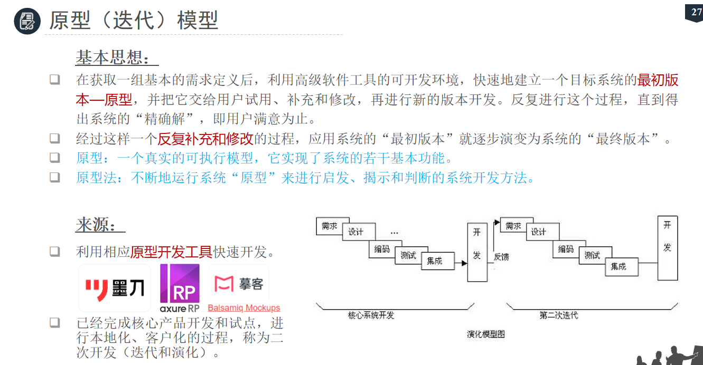
- 喷泉模型
  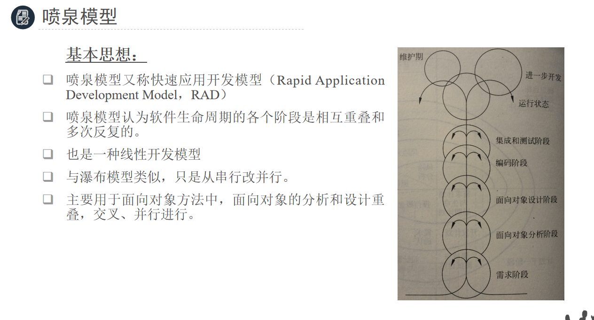
- 增量模型
  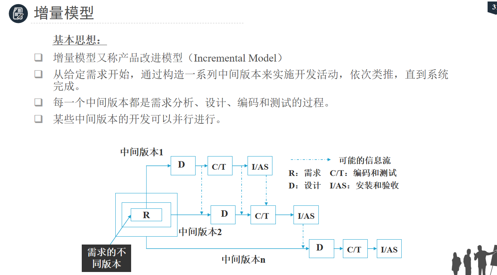  
  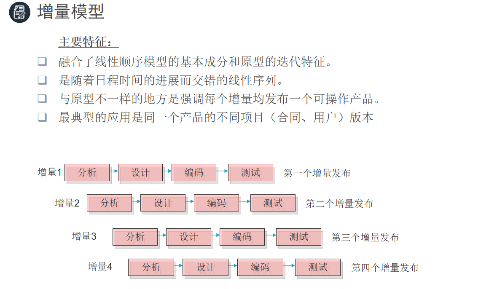
- 螺旋模型
  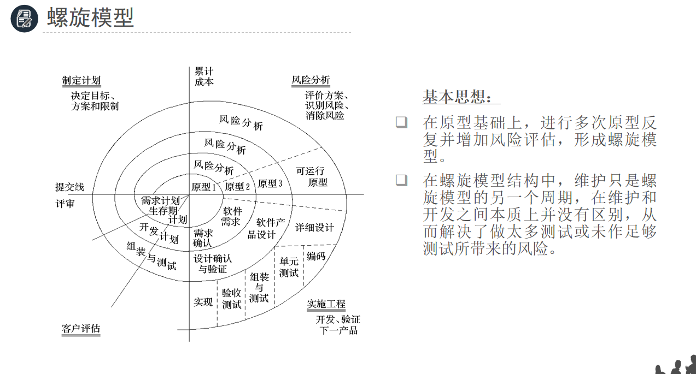
## 需求分析
- 业务流程图
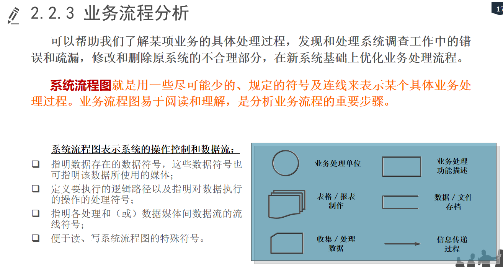  
- 环域复杂度
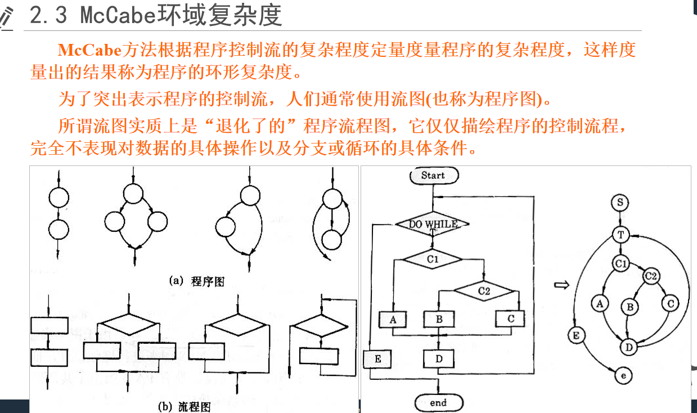  
  
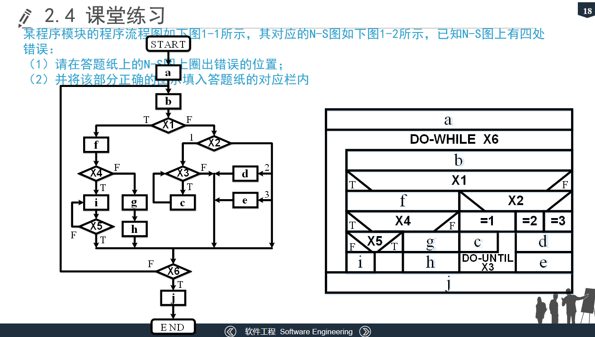  
- pad图
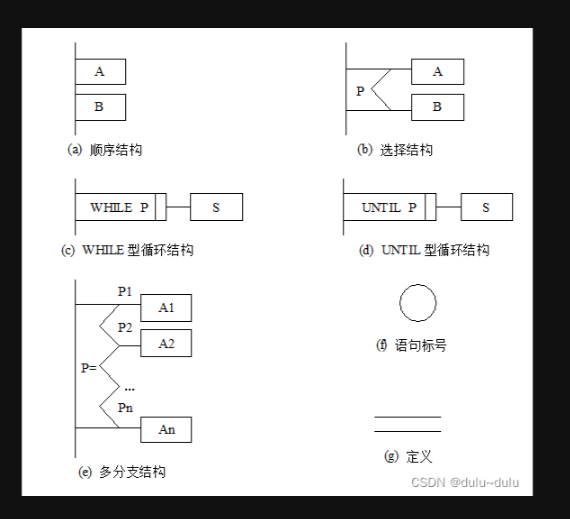  
## 软件测试
- 黑盒测试
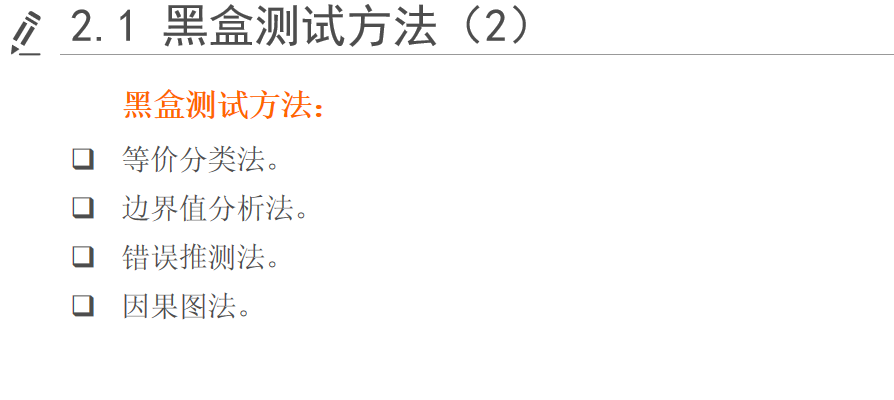  
- 白盒测试
- 
软件生命周期由软件定义、软件开发和运行维护三个时期组成

1. 软件定义阶段
2. 软件开发阶段
3. 运行维护阶段
问题定义
可行性研究
需求分析
总体设计
详细设计
编码和单元测试 
综合测试

## 数据流图
数据流图的四种元素：源点/终点，处理，数据流，数据存储
数字字典：
名字，别名，描述，定义，位置

## 内聚和耦合
  
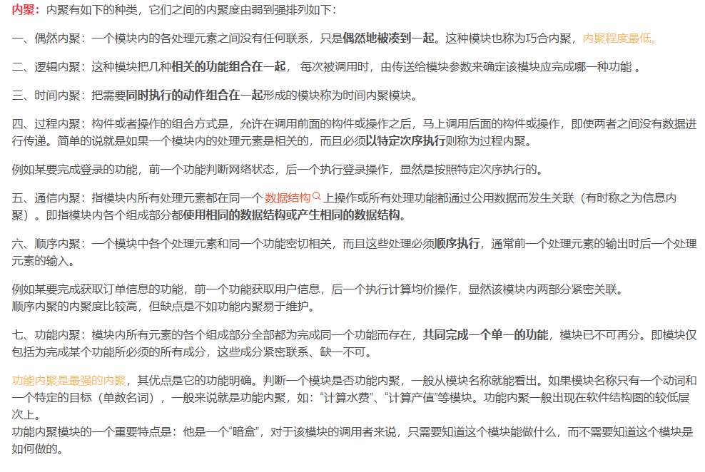  
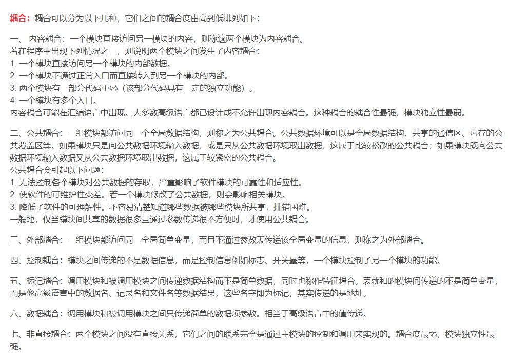  
  
软件可维护性度量的七个质量特性是可理解性、可测试性、可修改性、可靠性、可移植性、可使用性和效率

可行性研究主要集中在以下三个方面：经济可行性、技术可行性、操作可行性

面向对象模型主要由对象模型、动态模型、功能模型

软件需求分析过程应该建立数据模型、功能模型和行为模型三种模型之上

需求分析的最终结果是需求规格说明书

软件工程三要素包括方法、工具和过程，其中，过程是支持软件开发的各个环节的控制和管理

软件测试的步骤按顺序分别是：单元测试、子系统测试、系统测试、确认测试和系统测试

数据库的“概念设计”与“逻辑设计”分别对应于系统开发中的需求分析与概要设计，而数据库的“物理设计”与模块的详细设计相对应

模块化指解决一个复杂问题时（自顶向下）逐层把软件系统划分成若干（ 模块）的过程

软件结构往往用（ 树状或网状）结构的图形来表示。软件结构图是软件系统的（模块层次 ）结构

面向数据流的设计又称（ 结构化设计），它是以需求分析阶段产生的（ 数据流图）为基础，按一定的步骤映射成软件结构

数据流图一般可分为（变换型 ）和（ 事务型）两类

详细设计也称（过程设计 ），它是软件设计的第二阶段，主要确定每个（模块）的具体执行过程

处理过程设计中最典型的方法是（结构化程序设计 ）方法，其基本要点是采用的程序设计方法是（自顶向下 ）、（逐步求精 ）

测试用例由 （ 输入数据）和预期的（输出数据 ）两部分组成
软件测试方法一般分为两大类：（动态测试）方法和 （静态测试）方法

.动态测试通过（运行程序）发现错误。根据（测试用例）的设计方法不同，动态测试又分为 （黑盒测试）与（白盒测试）两类

黑盒法只在软件的（接口）处进行测试，依据（需求规格）说明书，检查程序是否满足（功能）要求
白盒法必须考虑程序的（内部结构）和（处理过程），以检查（处理过程）的细节为基础，对程序中尽可能多的逻辑路径进行（测试）
白盒测试是（结构） 测试，被测对象是（ 源程序），以程序的（内部逻辑）为基础设计测试用例
逻辑覆盖是对程序内部有（判定）存在的逻辑结构设计测试用例，根据程序内部的逻辑覆盖程度又可分为 （语句覆盖） 、（判定覆盖） 、（条件覆盖）、（判定/条件覆盖）、（条件组合覆盖） 和 （路径覆盖）6种覆盖技术
50.程序加注释对理解程序提供了明确指导，根据作用不同注释分（序言性注释） 和（功能性注释）